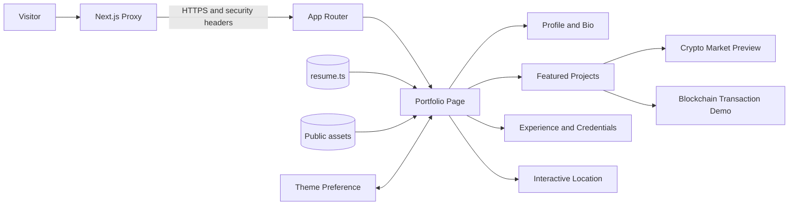
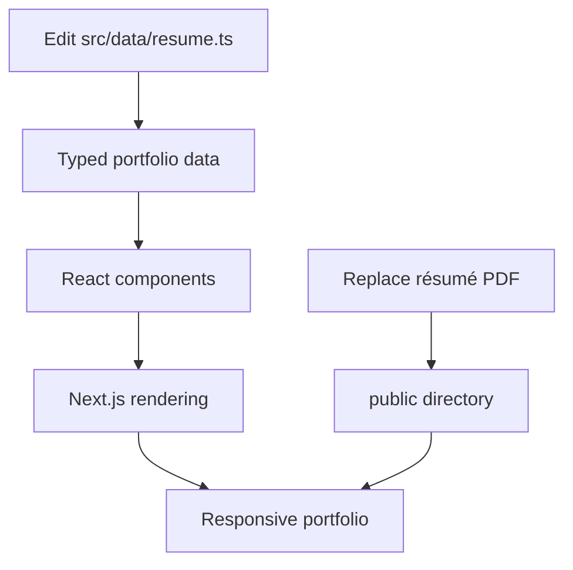

# Siddhesh Raje — Developer Portfolio

<div align="center">

A modern, responsive portfolio showcasing experience across front-end engineering, blockchain, and artificial intelligence.

[](https://nextjs.org/)
[](https://react.dev/)
[](https://www.typescriptlang.org/)
[](https://tailwindcss.com/)

[Getting Started](#getting-started) · [Architecture](#architecture) · [Customization](#customization) · [Production](#production)

</div>

## Overview

This repository contains Siddhesh Raje's personal portfolio, built with the Next.js App Router and TypeScript. It presents professional experience, skills, credentials, location, and featured work through an editorial, data-driven interface.

The site includes an interactive blockchain transaction demo, a cryptocurrency market preview, a responsive world map, light and dark themes, and a downloadable résumé. Portfolio content is centralized in a single typed data module, keeping routine updates separate from presentation code.

## Highlights

- Responsive, accessible interface for desktop and mobile devices
- System-aware light and dark themes with persistent user preference
- Featured cryptocurrency and blockchain project presentations
- Interactive location visualization built with D3 Geo and TopoJSON
- Structured experience, education, certification, and skills sections
- Self-hosted fonts for consistent rendering and improved privacy
- Downloadable PDF résumé and direct contact links
- Content Security Policy with per-request nonces and hardened HTTP headers
- Strict TypeScript configuration and ESLint quality checks

## Technology Stack

| Area | Technology |
| --- | --- |
| Framework | Next.js 16 with App Router |
| UI | React 19, TypeScript 5, Tailwind CSS 4 |
| Motion and icons | Framer Motion, Lucide React |
| Visualization | D3 Geo, TopoJSON Client, World Atlas |
| Typography | Space Grotesk, IBM Plex Sans, IBM Plex Mono |
| Quality | ESLint, strict TypeScript checks |
| Security | CSP nonces, HTTPS redirect, security response headers |

## Architecture



### Content flow



## Project Structure

```text
SiddheshApp/
├── public/
│   ├── images/                         # Portfolio artwork
│   └── Siddhesh_Raje_Resume.pdf        # Downloadable résumé
├── src/
│   ├── app/
│   │   ├── globals.css                 # Theme and application styles
│   │   ├── layout.tsx                  # Metadata, fonts, and theme bootstrap
│   │   └── page.tsx                    # Main portfolio composition
│   ├── components/                     # Reusable portfolio sections
│   ├── data/
│   │   └── resume.ts                   # Central portfolio content
│   ├── projects/                       # Project-specific demos and assets
│   └── proxy.ts                        # CSP, nonce, and HTTPS handling
├── next.config.ts                      # Next.js and security headers
├── package.json
└── tsconfig.json
```

## Getting Started

### Prerequisites

- [Node.js](https://nodejs.org/) 20.9 or later
- npm (included with Node.js)

### Installation

```bash
git clone https://github.com/SiddheshRaje/SiddheshApp.git
cd SiddheshApp
npm install
```

Start the development server:

```bash
npm run dev
```

Open [http://localhost:3000](http://localhost:3000) in a browser. Changes made to the source files are reflected automatically during development.

## Available Scripts

| Command | Description |
| --- | --- |
| `npm run dev` | Starts the local development server |
| `npm run build` | Creates an optimized production build |
| `npm run start` | Serves the production build |
| `npm run lint` | Runs ESLint across the project |

## Customization

Portfolio copy is maintained in [`src/data/resume.ts`](src/data/resume.ts). Update this module to change:

- Profile and contact information
- Professional experience
- Featured projects and technology stacks
- Education and certifications
- Technical skills and competencies

To update the downloadable résumé, replace [`public/Siddhesh_Raje_Resume.pdf`](public/Siddhesh_Raje_Resume.pdf) while retaining the same filename. Shared portfolio UI belongs in `src/components`, while isolated project implementations belong in `src/projects`.

Theme tokens, responsive layouts, and component styles are defined in [`src/app/globals.css`](src/app/globals.css).

## Production

Create and run a local production build:

```bash
npm run build
npm run start
```

The application can be deployed to any platform that supports Next.js. For Vercel, import the repository, retain the default Next.js build settings, and deploy. No environment variables are currently required.

## Security

The application adds a nonce-based Content Security Policy for rendered routes, redirects HTTP traffic to HTTPS in production, and configures headers that restrict framing, MIME sniffing, browser permissions, and cross-origin access. Review `src/proxy.ts` and `next.config.ts` before introducing external scripts, images, APIs, or embedded content because their origins must also be permitted by the policy.

## Accessibility and Performance

The interface uses semantic regions, accessible labels, keyboard focus states, responsive layouts, and reduced reliance on external assets. Fonts are bundled with the application, and client-side JavaScript is limited to interactive features such as theme selection, the live clock, map effects, and project demonstrations.

## License

No open-source license is currently included. The source code and portfolio content remain the property of the repository owner unless a license is added.

## Contact

**Siddhesh Raje** — Front-End Developer<br>
Mumbai, India

- [Email](mailto:siddhesh.raje28@gmail.com)
- [LinkedIn](https://linkedin.com/in/siddheshraje28/)
- [GitHub](https://github.com/SiDxxXx)

---

<div align="center">
Built with Next.js, React, and TypeScript.
</div>
